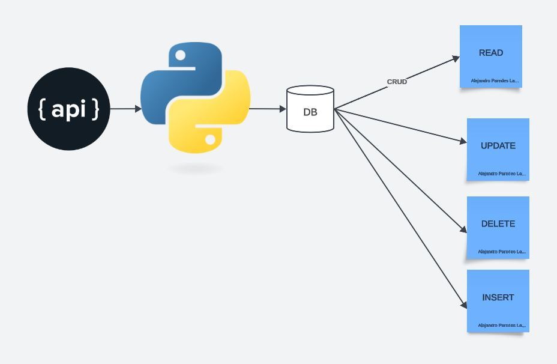

# IDS706_alejandroparedeslatorre_assignment5_SQL

This repo has an implementation to perform an ETL and a CRUD operation using sql lite.
We extract data from the api:

http://universities.hipolabs.com/search?country=United+States

Which is a toy dataset in json. And the loaded to the sql database.
Then we perform basic operations upon the database

* `Create` - insert

* `Read`

* `Update`

* `Delete`

According to the requirement we have

* `Makefile`

* `Dockerfile`

* `requirements.txt` with a set of specifications

* `githubactions` 

* `.devcontainer` for Githubcodespace 

## Purpose of project
The purpose of this project is to build a basic CRUD using python inbuilt sqllite libraries and to implement CLI operations.

## The architecture for the project is presented as follows:

## Sample CRUD Operations

python main.py create "Duke" USA US California example.com example.com
python main.py read
python main.py update 1 "Hardvard" BOL BO "Santa Cruz" example2.com example2.com
python main.py delete 1

## Preparation
1. open codespaces 
2. load repo to code spaces
2. Wait for the installation of all the requirements in requirements.txt